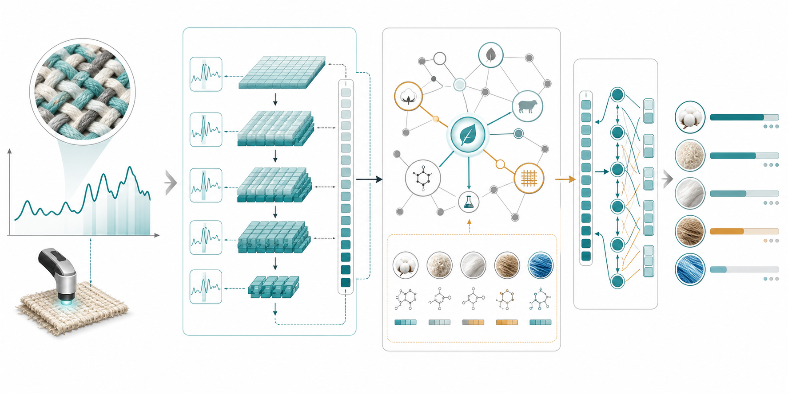
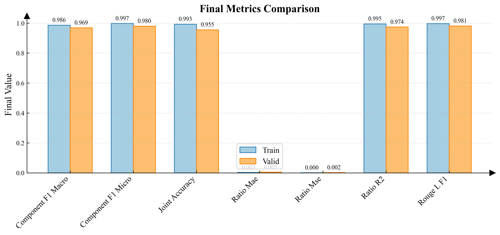
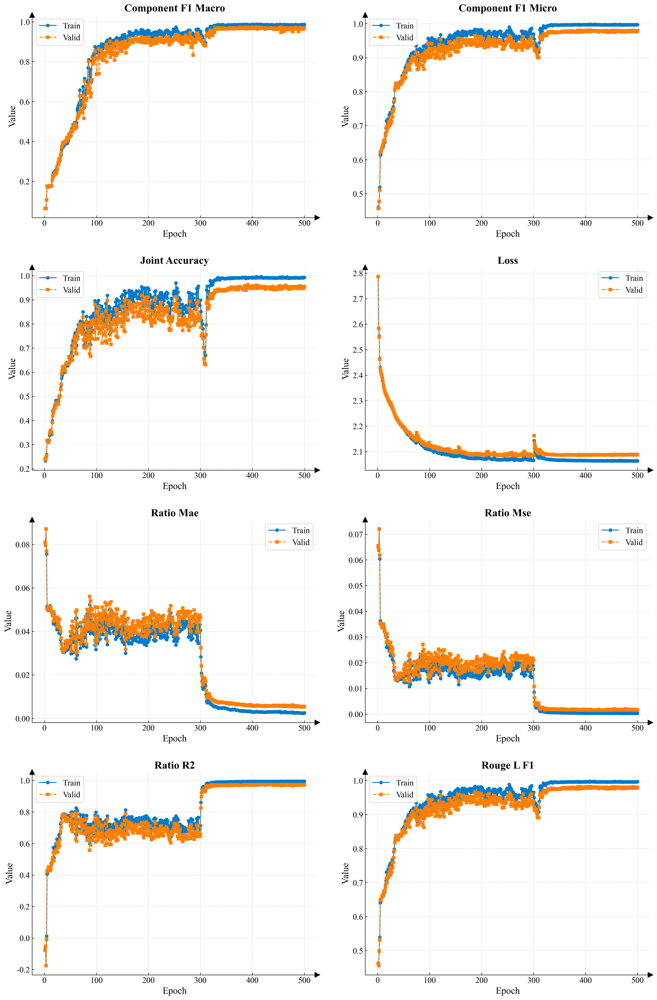

# FabricNIR

[中文](README.md) | English

FabricNIR is a PyTorch research project for recycled textile identification from near-infrared (NIR) spectra. It models the task as spectrum-to-label generation: given wavelength features, the model predicts compact composition labels such as `C93P7` and `P52N48`; the multi-task variant also predicts component ratios.


## Open-Source Scope

According to the data and model release policy, this repository contains only the public release subset:

- Only a few raw sample rows are published in `data/train.xlsx` and `data/valid.xlsx`
- The full raw dataset is not included
- Only one selected high-performing checkpoint is included: `checkpoints/fabricnir_best.pt`
- Intermediate training outputs, full data, extra checkpoints, installers, local IDE files, and caches are excluded from version control

## Paper

This repository accompanies the paper:

**FabricSpec-RAG: A knowledge graph-augmented Seq2Seq framework for quantitative analysis of complex textile blends from NIR spectra**  
Qiu Xun, Sun Fengqiang, Lyu Youlong, Sun Hengda, Wang Gang, Zhang Jie.  
*Analytica Chimica Acta*, 1417, 345729, 2026.  
DOI: <https://doi.org/10.1016/j.aca.2026.345729>  
ScienceDirect: <https://www.sciencedirect.com/science/article/pii/S0003267026006793>

The paper reports Micro-F1 = **0.9880** for component identification and MAE = **0.0026** for ratio prediction.

Note: this open-source release focuses on NIR Seq2Seq modeling, training, evaluation, visualization code, a small sample dataset, and one selected checkpoint. The full knowledge graph/RAG resources described in the paper are not bundled in this minimal public release.

## Method Overview

FabricSpec-RAG formulates quantitative NIR textile analysis as spectrum-to-structured-sequence generation. The following diagram shows the paper-level concept; this code release mainly covers spectral encoding, Seq2Seq decoding, training/evaluation, and visualization.



## Example Results

The following figures are selected from existing experiment visualizations and show the type of outputs produced by the project.

### Final Metrics



### Training Curves



## Project Layout

```text
FabricNIR/
├── checkpoints/             # Selected public checkpoint
├── configs/                 # Base and ablation configs
├── data/                    # Public sample workbooks
├── docs/readme_assets/      # README visual assets
├── results/best/            # Public best-result figures and metrics
├── results/multi_task_gru_random_multicov_nocbam/
│                             # Formal result figures used by README
├── experiments/             # Ablation orchestration
├── fabric_nir/              # Core Python package
│   ├── data/                # Datasets and preprocessing
│   ├── metrics/             # Metrics and logging
│   ├── models/              # Backbones, CBAM, decoders, Seq2Seq models
│   ├── tokenizers/          # Component tokenizers and vocabularies
│   ├── train/               # Trainers and self-supervised pretraining
│   ├── utils/               # Config and experiment helpers
│   └── visualization/       # Attention, embedding, SHAP, Grad-CAM utilities
├── scripts/                 # Evaluation and experiment helper scripts
├── main.py                  # Main entry point
├── README.md
├── README.en.md
└── requirements.txt
```

## Data Format

Input files are Excel workbooks located by default at:

- `data/train.xlsx`
- `data/valid.xlsx`

Each workbook should contain:

- `Labels`: textile composition labels, for example `C93P7` or `P52N48`
- Numeric wavelength columns, for example `950`, `955`, `960`, ...

The data loaders treat numeric columns as spectral features and normalize the spectral matrix before converting rows to PyTorch tensors.

## Installation

Python 3.9 or later is recommended.

```bash
python -m venv .venv
.venv\Scripts\activate
pip install -r requirements.txt
```

If you plan to train on GPU, install the PyTorch build that matches your local CUDA environment.

## Quick Start

Run a 1-epoch CPU smoke test on the sample data:

```bash
python main.py --config configs/base_config.yaml --device cpu --epochs 1
```

Run the default ablation matrix:

```bash
python main.py --matrix configs/experiment_matrix.yaml --device cpu --epochs 2
```

Note: the `pretrained` initialization in the ablation matrix requires running self-supervised pretraining first, or manually setting `model.pretrained.weights_path` in a derived config. Full intermediate pretrained weights are not published in this repository.

Run a selected experiment:

```bash
python main.py --experiment_id experiment_001 --device cpu --epochs 2
```

Training outputs are written to `results/`. The repository keeps only the selected best-result figures and metrics under `results/best/`; other generated outputs are ignored by default.

## Model Design

The project supports the following ablation dimensions:

- Decoder: GRU, LSTM, Transformer
- Task architecture: single-task, multi-task
- Initialization: random, pretrained
- Attention: with CBAM, without CBAM
- Backbone: dense, residual, multicov

The multi-task model predicts both component tokens and ratio regression values.

## Evaluation

`fabric_nir.metrics.MultiTaskMetrics` reports:

- Component accuracy, precision, recall, and F1
- Ratio MAE, MSE, RMSE, and R2
- Joint component-ratio accuracy
- BLEU and ROUGE generation metrics
- Weighted `overall_score`

## Checkpoint

The public checkpoint is stored at:

```text
checkpoints/fabricnir_best.pt
```

This checkpoint was selected from existing local experiment artifacts. Use the matching config file when loading it:

```bash
python main.py --config configs/fabricnir_best.yaml --device cpu --test_only
```

Do not load it directly with the default multi-task config; it is not guaranteed to load into every ablation variant.

Compatible config example:

```yaml
model:
  pretrained:
    use_pretrained: true
    weights_path: "checkpoints/fabricnir_best.pt"
```

## Citation

If this repository or paper is useful for your research, please cite:

```bibtex
@article{qiu2026fabricspecrag,
  title = {FabricSpec-RAG: A knowledge graph-augmented Seq2Seq framework for quantitative analysis of complex textile blends from NIR spectra},
  author = {Qiu, Xun and Sun, Fengqiang and Lyu, Youlong and Sun, Hengda and Wang, Gang and Zhang, Jie},
  journal = {Analytica Chimica Acta},
  volume = {1417},
  pages = {345729},
  year = {2026},
  doi = {10.1016/j.aca.2026.345729},
  url = {https://www.sciencedirect.com/science/article/pii/S0003267026006793}
}
```

## Maintainer Notes

- Keep the full raw dataset in a private local directory
- Publish only minimal sample data for format inspection
- Publish only one selected checkpoint
- Do not commit generated outputs outside `results/best/`, `__pycache__/`, `.codegraph/`, local IDE files, or installers
