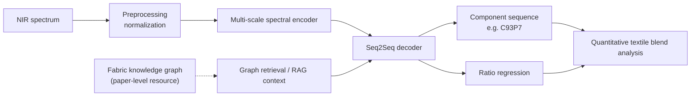
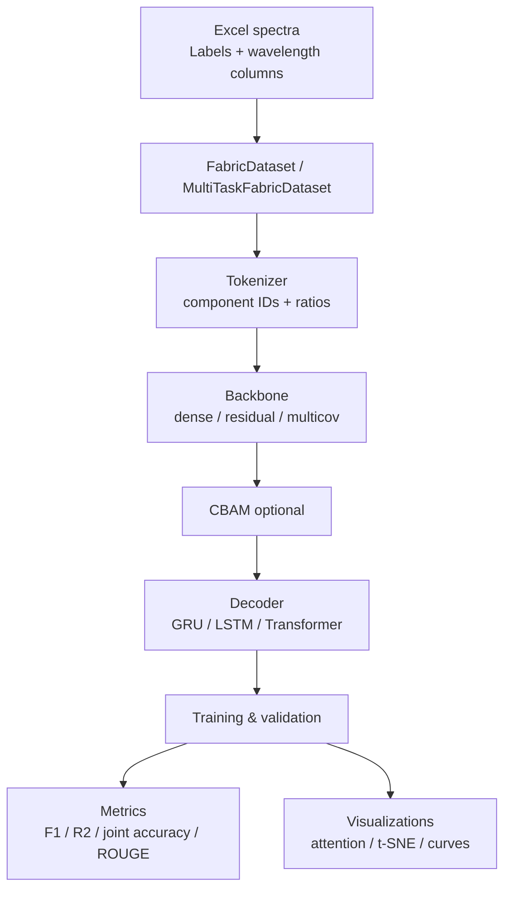
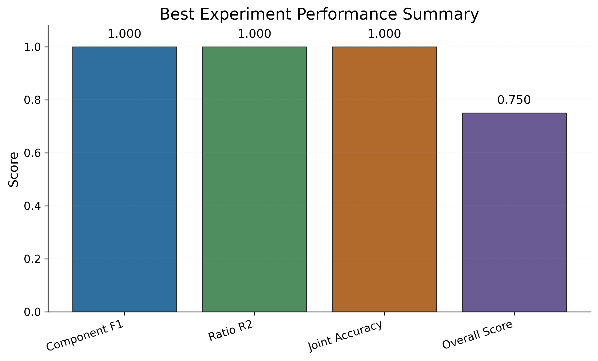
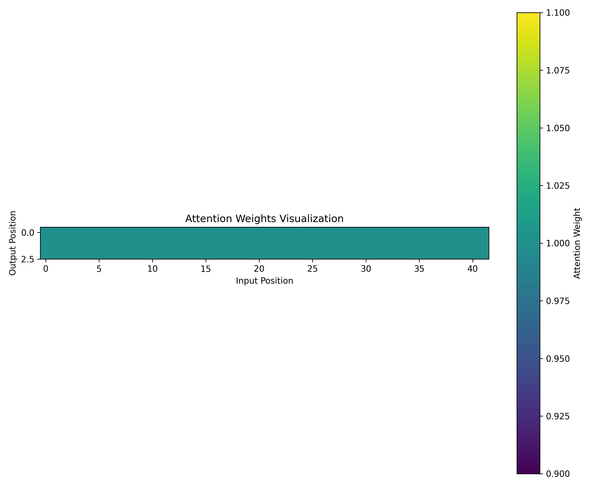
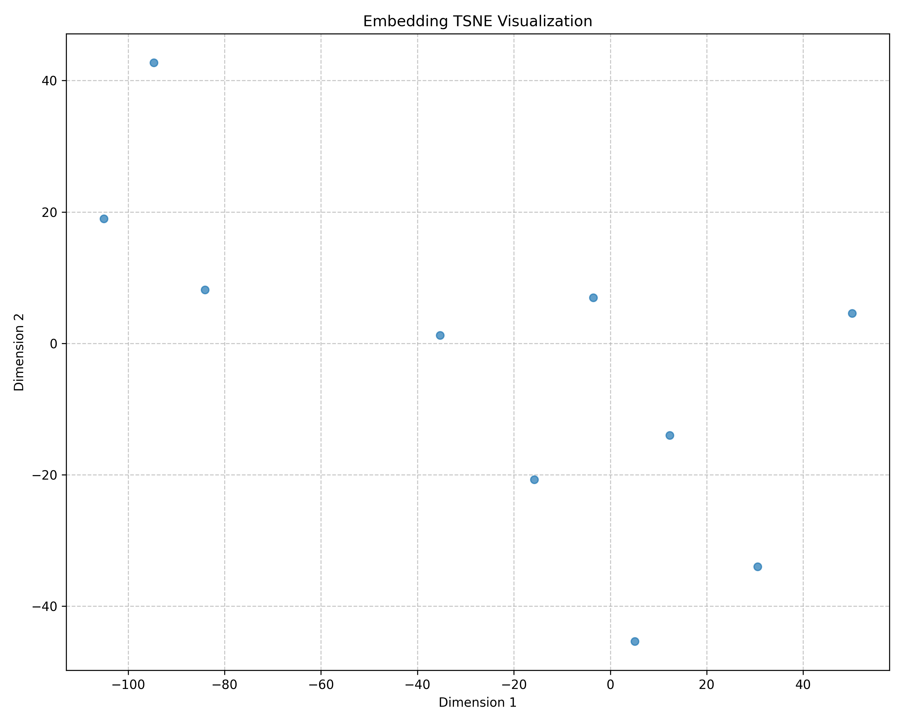

# FabricNIR

中文 | [English](README.en.md)

FabricNIR 是一个用于废旧纺织品近红外光谱识别的 PyTorch 研究项目。项目将 NIR 光谱建模为 spectrum-to-label 任务：输入波长反射率/吸收特征，输出类似 `C93P7`、`P52N48` 的纺织品成分标签；多任务模型还会同时预测各成分比例。

## 开源范围

根据数据与模型发布协议，本仓库只包含可公开发布的最小必要材料：

- 原始数据只开源少量样例：`data/train.xlsx` 和 `data/valid.xlsx`
- 完整原始数据不随仓库发布
- 模型权重只保留一个选定效果较好的 checkpoint：`checkpoints/fabricnir_best.pt`
- 训练中间结果、完整数据、额外模型、安装包、本地 IDE 配置和缓存文件均不纳入版本控制

## 论文

本仓库对应论文：

**FabricSpec-RAG: A knowledge graph-augmented Seq2Seq framework for quantitative analysis of complex textile blends from NIR spectra**  
Qiu Xun, Sun Fengqiang, Liu Youlong, Sun Hengda, Wang Gang, Zhang Jie.  
*Analytica Chimica Acta*, 2026.  
ScienceDirect: <https://www.sciencedirect.com/science/article/pii/S0003267026006793?via%3Dihub=>

论文报告的主要结果包括：成分识别 Micro-F1 = **0.9880**，比例预测 MAE = **0.0026**。

说明：当前开源版本重点发布近红外光谱 Seq2Seq 建模、训练、评估、可视化代码，以及少量样例数据和一个选定 checkpoint。论文级 FabricSpec-RAG 方法中的知识图谱/RAG 资源不随本最小开源包完整发布。

## 方法示意

FabricSpec-RAG 将近红外光谱的定量分析建模为“光谱到结构化成分序列”的生成任务。下图展示论文方法的概念流程；当前代码 release 主要覆盖光谱编码、Seq2Seq 解码、训练评估和可视化部分。



实验与开源代码的主要流程如下：



## 结果示例

以下图片来自已有实验可视化结果，用于展示模型训练和分析输出的形式。

### Best Experiment Metrics



### Attention Visualization



### Embedding t-SNE



## 项目结构

```text
FabricNIR/
├── checkpoints/             # 公开发布的选定模型权重
├── configs/                 # 基础配置与消融实验配置
├── data/                    # 可公开的少量样例数据
├── results/best/            # 公开展示的最佳结果图和指标
├── experiments/             # 消融实验编排脚本
├── fabric_nir/              # 核心 Python 包
│   ├── data/                # Dataset 与数据预处理
│   ├── metrics/             # 指标计算与日志记录
│   ├── models/              # Backbone、CBAM、Decoder、Seq2Seq 模型
│   ├── tokenizers/          # 成分标签 tokenizer 与词表
│   ├── train/               # 单任务、多任务训练器与自监督预训练
│   ├── utils/               # 配置与实验工具
│   └── visualization/       # Attention、Embedding、SHAP、Grad-CAM 可视化
├── scripts/                 # 评估和实验辅助脚本
├── main.py                  # 主入口
├── README.md
├── README.en.md
└── requirements.txt
```

## 数据格式

输入文件为 Excel 工作簿，默认路径为：

- `data/train.xlsx`
- `data/valid.xlsx`

每个工作簿应包含：

- `Labels`：纺织品成分标签，例如 `C93P7`、`P52N48`
- 数字波长列：例如 `950`、`955`、`960` 等

数据加载器会将数字列识别为光谱特征，并在转换为 PyTorch tensor 前进行归一化处理。

## 安装

建议使用 Python 3.9 或更高版本。

```bash
python -m venv .venv
.venv\Scripts\activate
pip install -r requirements.txt
```

如果需要 GPU 训练，请根据本机 CUDA 版本安装对应的 PyTorch。

## 快速开始

使用样例数据在 CPU 上跑一个 1 epoch 的 smoke test：

```bash
python main.py --config configs/base_config.yaml --device cpu --epochs 1
```

运行默认消融实验矩阵：

```bash
python main.py --matrix configs/experiment_matrix.yaml --device cpu --epochs 2
```

注意：消融矩阵中的 `pretrained` 初始化需要先运行自监督预训练，或在配置中手动提供 `model.pretrained.weights_path`。本仓库不会发布完整预训练中间权重。

运行指定实验：

```bash
python main.py --experiment_id experiment_001 --device cpu --epochs 2
```

训练输出会写入 `results/`。仓库只保留 `results/best/` 中选定的最佳结果图和指标，其余运行输出默认不提交到版本控制。

## 模型设计

项目支持以下消融维度：

- Decoder：GRU、LSTM、Transformer
- 任务架构：single-task、multi-task
- 初始化方式：random、pretrained
- 注意力机制：with CBAM、without CBAM
- Backbone：dense、residual、multicov

多任务模型同时预测成分 token 和比例回归值。

## 评价指标

`fabric_nir.metrics.MultiTaskMetrics` 提供以下指标：

- 成分识别 accuracy、precision、recall、F1
- 比例预测 MAE、MSE、RMSE、R2
- 成分与比例联合准确率
- BLEU 与 ROUGE 生成指标
- 加权综合分数 `overall_score`

## Checkpoint

公开 checkpoint 位于：

```text
checkpoints/fabricnir_best.pt
```

该权重来自已有实验中选定的较好结果。加载时请使用与该 checkpoint 匹配的配置文件：

```bash
python main.py --config configs/fabricnir_best.yaml --device cpu --test_only
```

不建议直接用默认多任务配置加载该 checkpoint；它不保证能直接加载到所有消融变体中。

兼容配置示例：

```yaml
model:
  pretrained:
    use_pretrained: true
    weights_path: "checkpoints/fabricnir_best.pt"
```

## 引用

如果本仓库或论文对你的研究有帮助，请引用：

```bibtex
@article{qiu2026fabricspecrag,
  title = {FabricSpec-RAG: A knowledge graph-augmented Seq2Seq framework for quantitative analysis of complex textile blends from NIR spectra},
  author = {Qiu, Xun and Sun, Fengqiang and Liu, Youlong and Sun, Hengda and Wang, Gang and Zhang, Jie},
  journal = {Analytica Chimica Acta},
  year = {2026},
  note = {Article PII: S0003267026006793},
  url = {https://www.sciencedirect.com/science/article/pii/S0003267026006793}
}
```

## 维护说明

- 完整原始数据放在本地私有目录，不提交到仓库
- 公开数据只保留少量格式样例
- 公开模型只保留一个选定 checkpoint
- 除 `results/best/` 外，不提交其他运行结果、`__pycache__/`、`.codegraph/`、本地 IDE 配置和安装包
